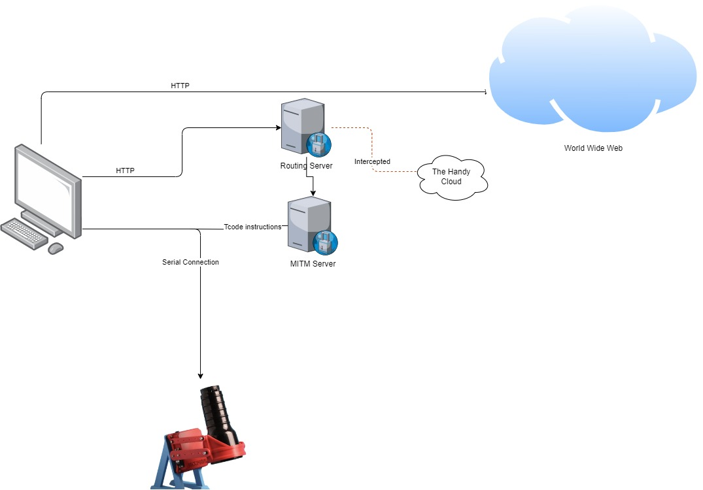

# Handy To OSR Converter!

This project is aimed to allow OSR owners to use online stroking games such as [fapinstructor](https://fapinstructor.com/), [fapchallenger](https://www.fapchallenger.com/), [strokeabeat](https://www.strokeabeat.com/) and many others.

The issue with most of these games is that they are only compatible with [the handy](https://www.thehandy.com/), and they are all single axis.
If you own a OSR or SR6, these games cannot integrate with your device.

However, following a few steps in this manual will allow you to connect your device to these games and even enjoy some of the multi axis features :)

## How it works?

These games use the handy's cloud API that alternate the devices state (stroke range and velocity).

In this project we will define a 'man in the middle' proxy (MITM) to intercept these requests and keep the state of the device on our own PC, and then the application will fire [Tcode instructions](https://docs.buttplug.io/docs/stpihkal/protocols/tcode/) to move the OSR device, and it will randomly move other axises to make it more fun :)

Currently it controls axis Stroke (L0), Surge (L1), Twist (R0) and Roll (R1).

## Components:

### 1. Routing server

The routing server intercepts only requests that goes out to the handy API, all the other requests are ignored, this is to avoid latencies in the display of media.

### 2. MITM server

The MITM server is the next in line layer of the proxy, after the routing server intercepted the request, it will be redirected to the MITM server.
It will parse the request and set it's state accordingly, and according to the state it will 

## Flow Chart

## Prerequisites

1. You need python 3.11 or 3.12 installed on your computer, to install python go to [python.org](https://www.python.org/.)
2. The OSR device needs to be powered on and the data cable connected to your computer.

## Installation

### Windows:

1. Clone this repository into a directory of your choice (project directory).
2. Open a command prompt in the project directory
3. Create a python virtual environment `python -m venv ./venv`
4. Activate your venv `venv\Scripts\activate`
5. Install PyPI dependencies `pip install -r requirements.txt`

### MAC (TBD)

## How to run

### Window

#### Run the servers:
1. Open a command prompt in the project directory.
2. Activate your venv `venv\Scripts\activate`
3. Run routing server `uvicorn fileserver:app --host 0.0.0.0 --port 8081 --reload`
4. Open another command prompt in the project directory.
5. Activate your venv `venv\Scripts\activate`
6. Open the `config.yaml` file in a text editor:
   1. In the `COM` section, set the channel to the channel where your device is connected to (COM1, COM2 etc).
   2. In the `COM` section, set the `debug` value to `flase`.
   3. In the `ranges` section, set the ranges of the axises to your preferences.
7. Run MITM server `mitmdump -s src\main.py --quiet`

#### Set the proxy

1. Press `Win + I` to open the **Settings** app.
2. In the Settings app, click on **Network & Internet**.
3. In the left-hand sidebar, select **Proxy**.
4. Under the **Automatic proxy setup** section, locate the option **Use setup script**.
5. Toggle the switch to **On**.
6. In the **Script address** box, enter the URL of the PAC file - `http://127.0.0.1:8081/resources/p.pac`
7. Click **Save** to apply the changes.

Now, all the requests that go to the handyfeeling api will be redirected to the mitm instead of the handy cloud server, and the mitm will generate Tcode instructions locally :)

### MAC (TBD)

## Try it out with fapinstructor:

1. Open a browser.
2. Go to [fapinstructor.com](https://fapinstructor.com).
3. In fapinstructor, click on the `CONNECT HANDY` button on the top left side of the screen.
4. Insert a 6-8 characters long connection key into the text box (completely fictitious :) )
5. Click `Connect` and wait until the website shows that handy is connected.
6. Setup the game as you want.
7. Position your self in the device.
8. Start the game and have fun :)

